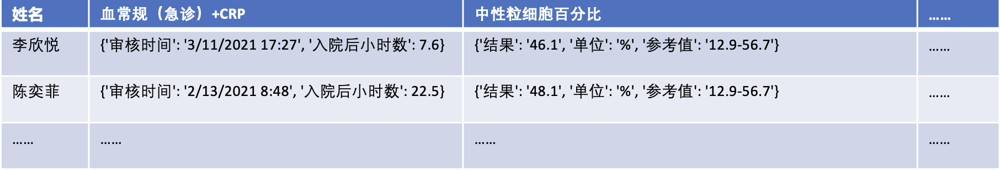
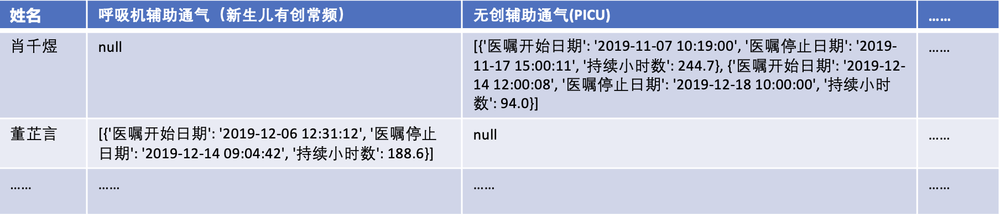
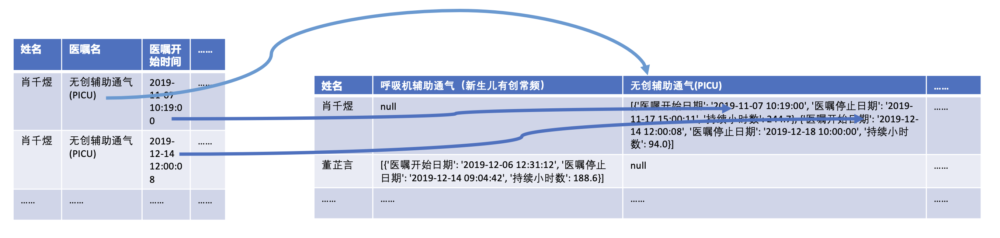

# 儿童脓毒症数据预处理

## 一、背景

​		当需要对儿童术后脓毒症进行预测时，将这一系列儿童脓毒症信息输入到机器学习算法模型中。输入的数据分为两大类，一类是特征实例，一类的特征实例所对应的标签，在本次的数据处理过程中我们主要是对特征实例的格式进行转换和拼接，对标签进行筛选。这些特征实例应该是一行一条，并且每一条特征实例应该要有一个标签。在以行为单位的特征实例中，每一列都代表着数据的一个特征。但在实际的医疗环境中，儿童脓毒症的信息被分开存放到了不同的表格中，并且有些表格内数据的格式与我们需要的数据格式有着一定的差别。因此我们需要使用一定的方式对这一类表格的数据格式进行转换，以达到要求。在达到基本的格式要求之后,正确的格式的数据就散落在几张不同的表格当中，此时我们还需要将这几张表格进行拼接，拼接成功之后便可以形成所需要的数据。

## 二、数据组成

​		具体的来说，数据被分散在**脓毒症呼吸机使用.csv**、**脓毒症检验数据.csv**、**脓毒症血管活性药物数据.csv**、**脓毒症基本信息-护理观察记录-查体.csv**这四张csv表格里面，由图2.1可知，脓毒症呼吸机使用.csv、脓毒症检验数据.csv、脓毒症血管活性药物数据.csv这三张表格的数据格式需要进行一定的转换才能够与脓毒症基本信息-护理观察记录-查体.csv进行合并，组合成一张特征实例表。

表2.1 数据组合结构表			

## 三、 数据转换

​		数据转换有三个步骤，第一步是确定数据转换的ID，ID具有唯一代表一个病人的特性，病人数据的转换也是通过ID作为一条数据的标识符。第二步是确定数据结构。第三步是确定标签。

###  3.1 确定ID

​			从ID的定义上来看，ID具有唯一性，一个ID就代表着一条数据，“就诊号”代表的是具体的一个病人在一次看病的过程中所产生的**唯一标识符**，能够代表这一次就诊，一次就诊也就是一条输入数据，就诊号在逻辑意义上可以代表ID。因此选用“就诊号”作为数据格式化的ID。

### 3.2 确定数据结构

​			在机器学习的数据结构要求中，需要数据以行为单位进行区分，一行代表着一条数据，一行当中的每一列代表的是该条数据的每一个特征（标签列除外），在一行数据中，存在一列为代表着结果的标签列。但在当前的数据格式中，特征是以列值的形式存在于数据表当中，具体需要的数据格式如下表所示。

表3.1 标准数据格式

​		但是实际数据的格式和需要的标准格式数据有着比较大的区别，因此我们需要对数据的格式进行转换。在数据格式的转换中需要转换的数据格式一共有两类，一类是包含时间序列数据的，一类是不包含时间序列数据的。包含时间序列数据的数据项需要特殊处理，将时间序列信息存储到对应的单元格内。不包含时间序列数据的数据项只需要进行行列转换即可。		

​		脓毒症呼吸机使用.csv即为包含时间序列数据的数据表。在脓毒症呼吸机使用.csv中，（如表3.2）一个病人对应着多条行记录，这些行记录中有一列或者几列数据应该作为列名（特征名）而不是作为列值存在的，如“医嘱名”这一列的值应该是作为列名而存在。从一行的角度来看，一个医嘱名对应着一个医嘱的开始时间，一个用户在两个不同的时间节点上有着相同的医嘱，这一类数据有着时间序列的特性，因此这一类数据在转换的时候不仅要将列转化为行，还需要将时间序列的信息存到特征对应的单元格内。实现序列信息是以json对象来表示一个时间节点的信息，将所有的json对象排列到一个列表中来表示整个时间序列。转换过程中，判定“就诊号”相同的项为一条数据，对数据进行转换。转换后的数据格式如表3.2，转换前“无创辅助通气（PICU）”是属于“医嘱名”列下的，经过数据转换之后变成了一个列，对应的患者所在行的数据如果拥有该属性的话就填充为该属性相关的信息或时间序列信息。具体数据转换方式如图3.4所示。

表3.2 脓毒症呼吸机使用表

表3.3 脓毒症呼吸机使用表-转换后

图3.4 数据格式转换图

​		脓毒症检验数据表.csv即为不包含时间序列的普通数据表。在脓毒症检验数据表.csv中，(如表3.4)，一个病人对应着多种检验目的，一种检验目的又对应着多种项目名称，在实际的数据格式要求中，我们需要将“检验目的”和“项目名称”这两列的数据转换为一个一个的特征，因此需要将数据进行行列转换。转换格式后的数据表如表3.5所示，原数据“检验目的”项的“血常规（急诊）+CRP”被转换到了列头作为一个特征，与其相关的数据项被转化为了特征值存到特征列下。

表3.5 脓毒症检验数据表

表3.6 脓毒症检验数据表-格式转换后

### 3.3 确定标签

主要诊断描述

在数据中有**主要诊断描述**和**医生主要诊断描述**两列，从下图中可以看出，脓毒血症在主要诊断描述中只有一种描述方式，然后对应的医生主要诊断描述中就有着6种不同的描述，如果要将**医生主要诊断描述**属性作为标签的话还需要基于规则对这些数据进行统一，但是如果直接使用主要诊断描述，其内容则是规整统一的，不需要多一步骤的后续处理。因此选用**主要诊断描述**作为标签

| 主要诊断描述 | 医生主要诊断描述 |
| ------------ | ---------------- |
| 脓毒血症     | 1.脓毒症         |
| 脓毒血症     | 脓毒症           |
| 脓毒血症     | 严重脓毒症       |
| 脓毒血症     | 脓毒症伴血流感染 |
| 脓毒血症     | 败血症           |
| 脓毒血症     | 脓毒症伴血流感染 |

表3.6 标签信息表